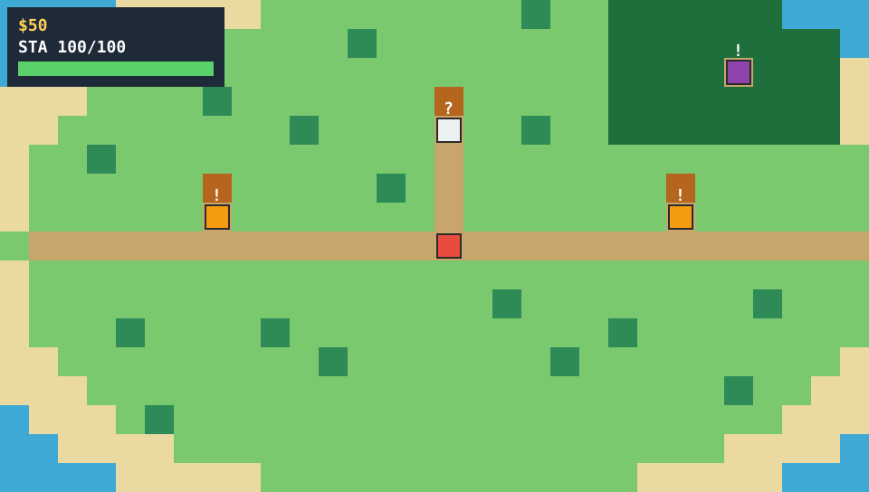
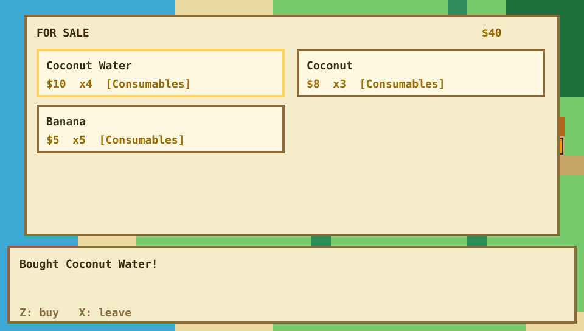
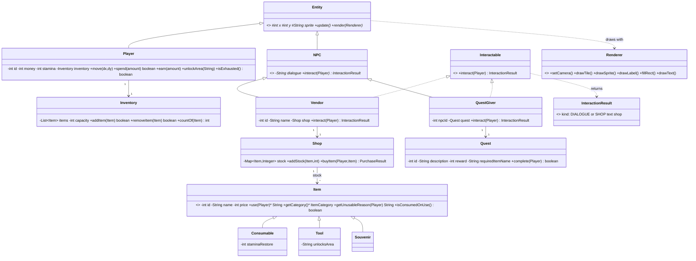
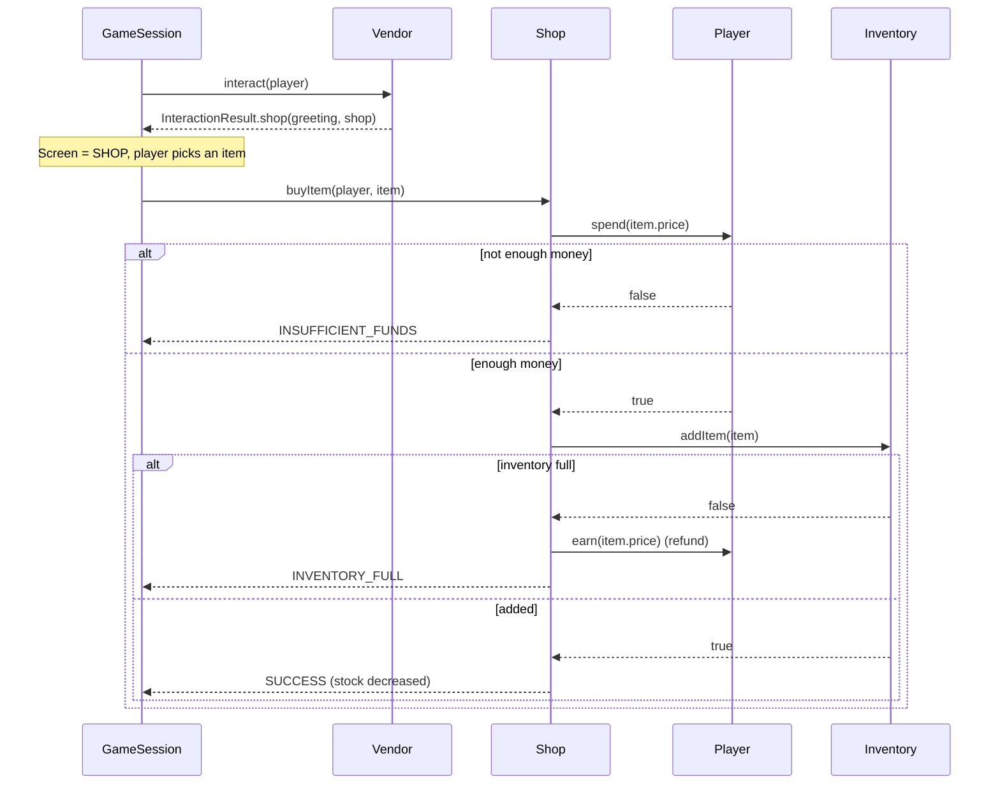

# Isla: A 2D Island Trading Adventure

Java OOP course project (UIC, College of Computing Education): a GBA-style top-down island game.
Walk around a tile-based island, buy items from vendors on a limited budget, manage a capacity-limited
inventory, and run a simple fetch quest. Progress is saved to MySQL.

**Author:** Pearl Kristian M. Gardose (Pj)

**Status:** milestones 1-3 done (walkable island, interaction/shop/inventory UI, MySQL persistence).
Milestone 4 (`DebugQuest`, the debug-the-code puzzle) and milestone 5 (main menu, polish, deck) are next.




## Run it

Requirements: JDK 21, Maven 3.9+. (MySQL is optional; without it the game runs but cannot save.)

```bash
mvn javafx:run          # play
mvn test                # unit tests (MySQL tests are skipped unless configured, see below)
```

Add `--new` to discard the saved game: `mvn javafx:run -Djavafx.args="--new"`.

### Enable saving (MySQL)

```sql
CREATE DATABASE isla CHARACTER SET utf8mb4;
```

Copy `db.properties.example` to `db.properties` (next to `pom.xml`) and fill in the URL, user and password.
The game creates the tables and seeds the island on first run (`src/main/resources/db/schema.sql`).
Progress is saved with **F5** and automatically when the window closes. If the database is missing or
unreachable the game starts anyway and shows "No database - progress will not be saved."

Run the MySQL DAO tests (they **empty** the tables in the database you name, so use a throwaway one):

```bash
mvn test -Disla.test.jdbcUrl=jdbc:mysql://localhost:3306/isla_test \
         -Disla.test.jdbcUser=isla -Disla.test.jdbcPassword=isla
```

## Controls

| Key | Action |
|---|---|
| Arrows / WASD | Walk, move cursor |
| Z / Enter / Space | Talk, confirm, buy, use |
| X / Esc / Backspace | Cancel, leave |
| I | Inventory (Left/Right switches tabs) |
| R | Rest (+10 stamina) |
| F5 | Save |

## How the game works

- Start with $50, 100 stamina, 6 inventory slots. Walking costs 1 stamina per 10 steps; at 0 you must rest (R) or use a consumable.
- Vendors (`!`) sell items with limited stock. Buying is blocked without enough money or with a full inventory (you are never charged for nothing).
- **Elder Kai** (`?`) wants a Coconut (sold by Mara for $8) and pays $25 once.
- The **Rusty Machete** (Tomas, $30) is a Tool: use it from the inventory to unlock the **Jungle Path**, which hides Yara's rare items.

## Architecture

```
isla            model: Entity, Player, NPC, Vendor, QuestGiver, Item (+3 subclasses), Inventory, Shop, Quest,
                       Interactable, InteractionResult, Renderer (interface)
isla.world      TileType, TileMap (loads maps/island.txt), GameWorld (movement, collision, interaction)
isla.game       GameSession (Actions -> state -> drawing), GameBootstrap (start/save), SeedData (starting content)
isla.dao        Repository<T> + ItemDAO/PlayerDAO/VendorDAO/QuestDAO, in-memory and JDBC implementations
isla.ui         JavaFX only: IslaApp, JavaFxRenderer, KeyBindings
```

Only `isla.ui` imports JavaFX. Everything else draws through the small `Renderer` interface, so the whole game
is unit-tested without a window (112 tests).

### OOP pillars

- **Encapsulation:** `Player.spend()` validates funds; `Inventory` and `Shop` keep their collections private and enforce capacity/stock; `Player.getUnlockedAreas()` is read-only.
- **Inheritance:** `Player`/`NPC` extend `Entity`; `Vendor`/`QuestGiver` extend `NPC`; `Consumable`/`Tool`/`Souvenir` extend `Item`.
- **Polymorphism:** `Item.use()` and `Item.getUnusableReason()` differ per subclass; `Interactable.interact()` returns a shop for a `Vendor` and dialogue for a `QuestGiver`; `Entity.render()` draws a "!" for vendors and a "?" for quest givers.
- **Abstraction:** `Entity`, `NPC`, `Item` are abstract; `Interactable`, `Renderer` and the DAO interfaces hide how things are drawn or stored.

### Class diagram



### Sequence diagram: player buys an item



## Database

`players`, `items`, `inventory`, `vendors`, `shop_stock`, `quests` as in the original plan, plus a few additions
the game needs (see `docs/BUILD_LOG.md`): table `unlocked_areas`, and columns `items.unlocks_area`,
`quests.required_item`, `vendors.sprite`, `vendors.dialogue`. The DAO layer (`Repository<T>`: `save`,
`findById`, `findAll`, `delete`) has an in-memory and a JDBC implementation; both pass the same contract
tests (`DaoContractTest`).

## Editing the island

`src/main/resources/maps/island.txt` is plain text, one character per tile:
`g` grass, `s` sand, `w` water (blocked), `p` path, `t` palm (blocked), `h` hut (blocked),
`j` jungle (needs the Jungle Path). A test checks that every NPC stays reachable (the jungle trader only after unlocking).

## Project docs

- `docs/superpowers/specs/2026-10-04-isla-design.md`: approved design
- `docs/superpowers/plans/2026-10-04-isla-milestones-1-3.md`: implementation plan
- `docs/BUILD_LOG.md`: what was built, decisions, verification, limitations

## Roadmap

- [ ] Milestone 4: `DebugQuest extends Quest` (multiple-choice debugging puzzle for the teacher's requirement)
- [ ] Milestone 5: main menu (Start / Continue / Settings), real art, Figma prototype, pitch deck
